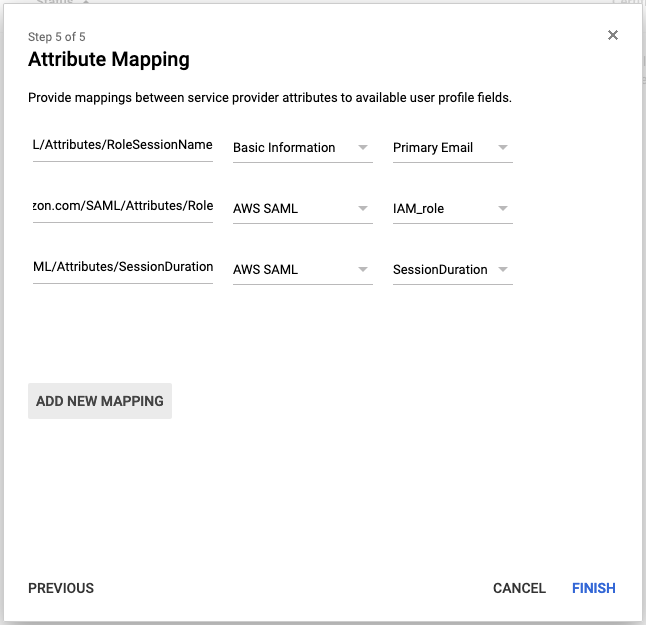

Identity and Access Management with AWS IAM has been great, but logging in to AWS with impossible-to-remember complex passwords made mandatory by ruthless password policies and ever annoying Multi-Factor Authentications have made a simple sign in process to be a night mare.

We all have faced this and have always looked for better solutions. Google SAML login is to the rescue. It is Secure, Easy and Password-less mechanism to log in your AWS account.

Today, I'll walk you through the detailed steps to configure Google SAML to be able to login to your AWS account with assigned IAM Role.

### Prerequisites

Before you begin this guide you'll need the following:

- AWS Account access with full IAM privileges
- Google Suite Admin access with Super Admin privileges

### Step 1 — Setup SAML App in Google Admin

Let us initiate our SAML creation process. Login to [Google Admin console](https://admin.google.com/).

Click on Users in the admin console.

Now click on Manage Custom Attributes icon as shown below,

Click on Add Custom Attributes and add attributes as shown in the following image,

Save the attributes, and navigate back to Google Admin Home page.

Click on Apps in the admin console,

Click on SAML apps,

At the right bottom, you show see a floating action button with plus icon, click on it to add a new service. This might be different based on updates to Google Suites, perform relevant action to add a new service on this screen.

Once you see the popup to Enable SSO for SAML Application, check if there is Amazon Web Services or AWS available in the App list and select it, else click on `SETUP MY OWN CUSTOM APP` as visible at the bottom

Download th IDP metadata file in Option 2 as shown and click on next,

Enter the Application Name, Description and Upload the logo for application

You may download the following AWS Logo and use it,

On next screen, enter ACS URL as `https://signin.aws.amazon.com/saml` and Entity ID as `urn:amazon:webservices`, click next

Next screen in for Attribute Mapping. Make sure you add 3 mappings on this screen as following,

https://aws.amazon.com/SAML/Attributes/RoleSessionName  -  Basic Information  -  Primary Email

https://aws.amazon.com/SAML/Attributes/Role  -  AWS SAML  -  IAM_ROLE

https://aws.amazon.com/SAML/Attributes/SessionDuration  -  AWS SAML  -  SessionDuration

The 3 attributes are to store details with Google about our AWS Session.

RoleSessionName is to identify the user

Role is the role of the user to be logged in

SessionDuration is the validity duration of a single user's session before requiring him to login again

We are done with SAML app configuration in Google Admin. Now let us head to AWS to use this SAML app.

### Step 2 — Create SAML Identity Provider in AWS

Navigate to AWS IAM and click on Identity Providers.

Click on Create Provider

Select Provider Type as SAML

Enter Provider Name as `GoogleSAML`

Upload the XML IDP metadata file we downloaded earlier from Google Admin console as Metadata Document on this Page

Click on Next Step, verify the details on the screen and click on Create

Done! Almost!

### Step 3 — Configure Role for SAML Users

Now that configurations are done, it is time to create some roles and assign it to our new SAML users.

Navigate to AWS IAM and click on Roles

Create a new role, select type of Trusted Entity as SAML 2.0 federation.

Select SAML Provider as GoogleSAML, our newly created identity provider

Select `Allow programmatic and AWS Management Console access` to allow Management Console access to users.

Verify if your screen looks as shown below,

Click on Next

Select policy you wish to assign a user. Considering you are creating Administrator Role, let's give this user AdministratorAccess Policy.

On next screen, add tags to this role and finally give role name as `saml_administrator`, and click on create role

Similarly, create roles for all type of users, select/create appropriate policy and name them as `saml_rolename`

For Example,

- saml_administrator
- saml_developer
- saml_qa
- saml_billing

### Step 4 — Assign IAM Roles to Google Users

Once we have created identity provider and roles, we need to assign them to Google users for them to be able to access AWS using SAML login

We need to know the ARN for Identity provider and Role to assign to the user

Navigate to IAM, click on Identity Provider and copy its ARN

Similarly, click on Roles, select the role to assign and copy its ARN

Once you have ARN for both, go to Google Admin -> Users and click on user to assign the role

Click on User Information and scroll to AWS SAML section

Enter the IAM_Role as (NO SPACES),

ROLE_ARN,IDENTITY_PROVIDER_ARN

For example,

arn:aws:iam::123456789012:role/pe-role-administrator,arn:aws:iam::123456789012:saml-provider/GoogleSAML

Enter the Session Duration as 43200 (12 Hours)

Click save, Done!

## Additional Steps

To access you AWS account, go to GMail, click on App icon on right top section, scroll to bottom to find AWS icon, click on it and it should redirect you to AWS console. This might take 10 mins to reflect after assigning role to a user in Google Admin.

To add access for multiple AWS accounts using SAML, you can use the same IDP meta file for multiple AWS accounts to create Identity Provider, so start from step 2 for any other AWS account. As IAM_Role is a Multi-value field, you can add multiple IAM roles for a single or mutliple AWS accounts.

## Conclusion

We configured Google SAML to access AWS account for user and assigned AWS IAM role to this user. Any user who is not assigned any role in Google Admin for AWS will not be able to login to AWS using SAML. This makes your AWS account available but restricted across your organisation.