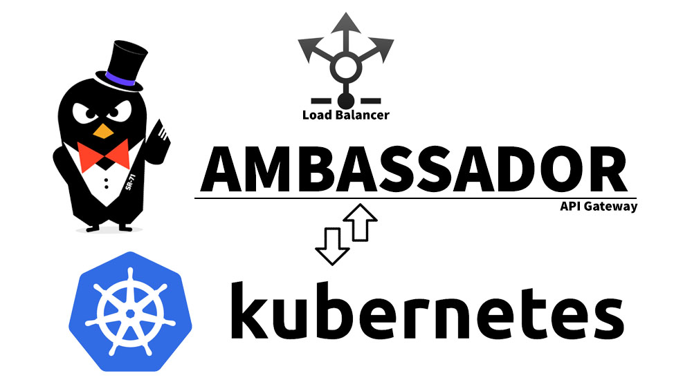

API Gateway is an important aspect in your Kubernetes deployment for your services. It acts as an single entry point and can help simplify a lot of tasks like Service Discovery, Distributed Tracing, Routing, Rate Limiting. It can offer a great flexibility and better configuration for your services.

Envoy is one of the very popular API gateways currently available which can handle extensive loads. With Kubernetes, Ambassador is the most popular and efficient way to use Envoy.

Today, I'll walk you through the detailed steps to deploy Ambassador on a Kubernetes cluster we deployed in my previous post, and configure it to use AWS load balancer for incoming traffic and route it to various services based on rules.

### Prerequisites

Before you begin this guide you'll need the following:

- Kubernetes cluster as per my [previous post](https://krish512.com/setup-kubernetes-cluster-kops-aws/)
- SSL certificate using ACM for Domain
- Linux machine acting as deployment server, preferably Ubuntu 16.04 or later


### Step 1 — Deploy Ambassador on Kubernetes Cluster

Deploying Ambassador is easiest with Kubernetes as the YAML configuration is readily available on Ambassador's site. If you have referred to my previous article about creating a [Kubernetes cluster on AWS](https://krish512.com/setup-kubernetes-cluster-kops-aws/) then you already have RBAC enabled.

Refer Ambassador's [official documentation](https://www.getambassador.io/user-guide/getting-started/) in case you do not have RBAC enable or any issues with the above command.

Log on to your deployment server and execute the following kubectl command,

```bash
kubectl apply -f https://getambassador.io/yaml/ambassador/ambassador-rbac.yaml
```

You can also use Helm to deploy Ambassador.

Firstly add the Helm repo as maintained by Datawire (Ambassador team)

```bash
$ helm repo add datawire https://www.getambassador.io
```

Now deploy Ambassador with Helm as,

```bash
$ helm upgrade --install --wait ambassador datawire/ambassador
```

This will take some time and create Ambassador deployment and pods in your default namespace. Verify if the pods were created using the following command,

```bash
$ kubectl get pods
```

Expect following output
```
Output:
NAME                          READY   STATUS    RESTARTS   AGE
ambassador-6dfd64dd49-dgmcf   2/2     Running   0          1d
ambassador-6dfd64dd49-mz5bf   2/2     Running   0          1d
ambassador-6dfd64dd49-xd6g4   2/2     Running   0          1d

```

If you can see 3 Ambassador pods running then you've successfully setup Ambassador. Let's move to next step where we'll create a load balancer endpoint to expose our API Gateway.

### Step 2 — Create Ambassador Service and Loadbalancer

All the incoming traffic to our Kubernetes services needs to be routed through our API Gateway Ambassador.

Ambassador uses a load balancer from AWS to receive all the traffic and routes them to Ambassador service to be able to apply rules and route them further to configured services.

Before creating our load balancer, let us have a HTTPS certificate ready using AWS ACM service for our domain `krish512.com` and secondary domain `*.dev.krish512.com`. You may add upto 8 secondary domains as per your requirements.

Let us now create a service for Ambassador. Create a file as `ambassador-service.yaml`

```bash
$ touch ambassador-service.yaml
```

Now using VIM or nano editor, open the file and insert the following yaml content,

```yaml
apiVersion: v1
kind: Service
metadata:
  labels:
    service: ambassador
  name: ambassador
  annotations:
    service.beta.kubernetes.io/aws-load-balancer-ssl-cert: "arn:aws:acm:ap-south-1:123403005789:certificate/1a2b3c54-b001-12fg-9h33-f98f7f65432d"
    service.beta.kubernetes.io/aws-load-balancer-ssl-ports: "443"
    service.beta.kubernetes.io/aws-load-balancer-backend-protocol: "http"
    service.beta.kubernetes.io/aws-load-balancer-cross-zone-load-balancing-enabled: "true"
    service.beta.kubernetes.io/aws-load-balancer-proxy-protocol: "*"
    service.beta.kubernetes.io/aws-load-balancer-extra-security-groups: "sg-01a889992221b2cde"
    getambassador.io/config: |
      ---
      apiVersion: ambassador/v1
      kind:  Module
      name:  tls
      config:
        server:
          enabled: True
          redirect_cleartext_from: 80
spec:
  loadBalancerSourceRanges:
  - 0.0.0.0/0
  type: LoadBalancer
  ports:
  - name: ambassador-http
    port: 80
    targetPort: 80
  - name: ambassador-https
    port: 443
    targetPort: 80
  selector:
    service: ambassador
```

In the above yaml, the annotations section specifies our load balancer details. As AWS ALB is not supported with Kubernetes currently, this will create a classic load balancer for Ambassador.

Value for `service.beta.kubernetes.io/aws-load-balancer-ssl-cert` field is the ARN of our certificate from AWS ACM
Value for `service.beta.kubernetes.io/aws-load-balancer-ssl-ports` states our HTTPS port for load balancer
The key `service.beta.kubernetes.io/aws-load-balancer-extra-security-groups` is optional and allows us to add extra security group rules and attach them to our load balancer by specifying security group id as its value.

In the specs section, `loadBalancerSourceRanges` is again an optional key used to restrict access to load balancer using its default security group. We have kept it open, this is just for demonstration purpose. You can remove this field or change the value as per your requirements.

Let us create the service now.

```bash
$ kubectl apply -f ambassador-service.yaml
```

This should immediately create a service and initiate a load balancer creation in your AWS EC2 console.

To avoid specifying DNS mapping for each sub domain, point `*.dev.krish512.com` to this load balancer in AWS Route53 service.

### Step 3 — Deploy Services and Route using Ambassador

To test our Ambassador setup and its features, we'll deploy 2 services on Kubernetes and route traffic to them via Ambassador using annotations.

Let us first create a development namespace for our new services.

```json
{
  "kind": "Namespace",
  "apiVersion": "v1",
  "metadata": {
    "name": "development",
    "labels": {
      "name": "development"
    }
  }
}
```

Save the above json as `development-namespace.json` and execute the following kubectl command to create namespace

```bash
$ kubectl create -f development-namespace.json
```

Now let us create httpd pod using a deployment and expose it to ambassador using a service.

```yaml
---
apiVersion: v1
kind: Service
metadata:
  name: httpd-service
  namespace: development
  annotations:
    getambassador.io/config: |
      ---
      apiVersion: ambassador/v1
      kind: Mapping
      name: httpd-service_mapping
      host: service1.dev.krish512.com
      prefix: /
      service: httpd-service.development:80
spec:
  selector:
    app: httpd
    environment: development
    role: web
  ports:
  - protocol: TCP
    port: 80
---
apiVersion: extensions/v1beta1
kind: Deployment
metadata:
  name: httpd
  namespace: development
spec:
  replicas: 1
  strategy:
    type: RollingUpdate
  template:
    metadata:
      labels:
        app: httpd
        environment: development
        role: web
    spec:
      containers:
      - name: httpd
        image: "httpd"
        ports:
        - containerPort: 80
```

Save the above yaml as `httpd.yaml`.

In the above yaml, we have created an annotation `getambassador.io/config` which is used for ambassador configuration. These annotations can be configured in Ambassador service if you wish to manage them centrally.

In this annotation, we have mapped ambassador configuration to a service and specified the name as `httpd-service_mapping`.

For routing purpose, we have asked Ambassador to route all requests coming for host `service1.dev.krish512.com` with base route `/` to service `httpd-service.development:80` where `httpd-service` is the service name, `development` is namespace and `80` is port exposed for the service.

Let us create this httpd service in Kubernetes by the following kubectl command,

```bash
$ kubectl apply -f httpd.yaml
```

This should take a minute to create the pod for our deployment and be available. Verify if the pod is available using the following,

```bash
$ kubectl get pods -n development
```

Expect following output,
```
Output:
NAME                             READY   STATUS    RESTARTS   AGE
httpd-56ddd7c88b-ddksp           1/1     Running   0          28m
```

Now go to your browser, and enter the url `https://service1.dev.krish512.com`, you should be able to see output as below


Similarly, let us create Nginx pod using a deployment and expose it to ambassador using a service as,

```yaml
---
apiVersion: v1
kind: Service
metadata:
  name: nginx-service
  namespace: development
  annotations:
    getambassador.io/config: |
      ---
      apiVersion: ambassador/v1
      kind: Mapping
      name: nginx-service_mapping
      host: service2.dev.pharmeasy.in
      prefix: /nginx
      service: nginx-service.development:80
spec:
  selector:
    app: nginx
    environment: development
    role: web
  ports:
  - protocol: TCP
    port: 80
---
apiVersion: extensions/v1beta1
kind: Deployment
metadata:
  name: nginx
  namespace: development
spec:
  replicas: 1
  strategy:
    type: RollingUpdate
  template:
    metadata:
      labels:
        app: nginx
        environment: development
        role: web
    spec:
      containers:
      - name: nginx
        image: "nginx"
        ports:
        - containerPort: 80
```

Save the above yaml as `nginx.yaml` and execute,

```bash
$ kubectl apply -f nginx.yaml
```

This should again take a minute to create the pod. Verify if the pod was created successfully using the following,

```bash
$ kubectl get pods -n development
```

Expect following output,
```
Output:
NAME                             READY   STATUS    RESTARTS   AGE
httpd-56ddd7c88b-ddksp           1/1     Running   0          10m
nginx-6455785f94-z992f           1/1     Running   0          1m
```

In this yaml, we have pointed domain `service2.dev.krish512.com` with route `/nginx` to Nginx service.

In your browser, try the url `https://service2.dev.krish512.com/nginx` and expect the following screen,


Try adding more pods and expose them using service with Ambassador annotations to be able to route and manage them. Refer [Ambassador documentation](https://www.getambassador.io/reference/configuration) for more configuration options.

## Additional Steps

Ambassador has a diagnostic UI which can be used for debugging and diagnostic purposes. Every Ambassador pod exposes this UI at port 8877. We can create a service to expose this UI running at port 8877 of pods and can map it to a domain `ambassador.dev.krish512.com`

Let's create a service to expose diagnostic UI as following:

```yaml
---
apiVersion: v1
kind: Service
metadata:
  name: ambassador-diagnostic
  annotations:
    getambassador.io/config: |
      ---
      apiVersion: ambassador/v1
      kind: Mapping
      name: ambassador-diagnostic_mapping
      host: ambassador.dev.krish512.com
      timeout_ms: 30000
      prefix: /
      service: ambassador-diagnostic:8877
spec:
  selector:
    service: ambassador
  ports:
  - protocol: TCP
    port: 8877
```

Now just visit `https://ambassador.dev.krish512.com` and you should be able to see something like this UI:


## Conclusion

We created an API Gateway for our services hosted in Kubernetes. With this, we are able to route traffic to a specific service based on request headers like hostname, URI, etc. We will use this in future to expose more services via our Ambassador API Gateway.

As our next step, we'll [deploy Kubernetes dashboard](/install-kubernetes-dashboard/) in my next post and expose its endpoint using Ambassador.