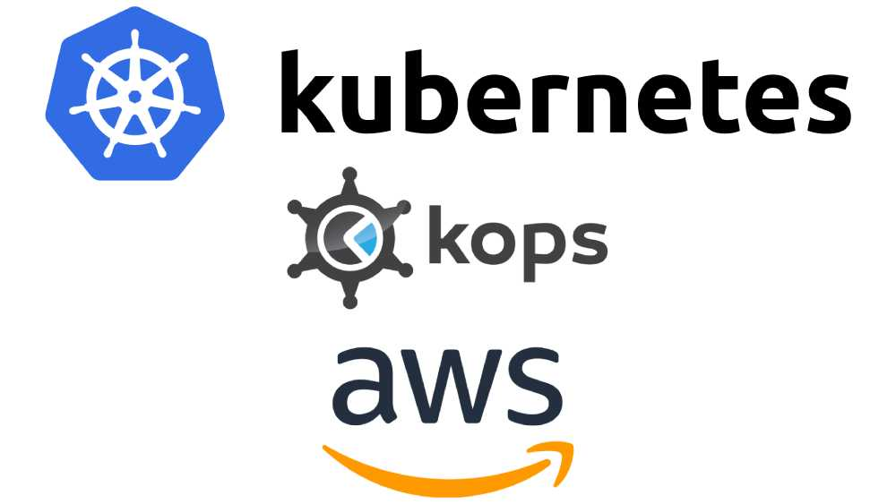

Kubernetes is currently the most popular container orchestration system and has definitely gained that popularity because of the amazing features and ease of container automation. Even though Kubernetes automates most of the container lifecycle processes, setting up a Kubernetes cluster has been a big pain point. With Kops, it makes setting up a cluster so darn easy that it just works without much hassle!

Even though Kops makes it a cake walk to create Kubernetes cluster, there are some best practices we need to ensure so that we create an optimal K8S cluster.

Today, I'll walk you through the detailed steps to create a Kubernetes cluster with 3 master nodes and 2 worker nodes with 1 AWS On-demand instance and 1 AWS Spot instance within a private topology with multi-availability zones deployment.

### Prerequisites

Before you begin this guide you'll need the following:

- Familiarity with AWS (of course), along with an AWS account
- Domain to access Kubernetes APIs
- Hosted Zone in Route53 for the Domain
- SSL certificate using ACM for the Domain
- IAM user with full S3, EC2, Route53 and VPC access
- Linux machine acting as deployment server, preferably Ubuntu 16.04 or later
- AWS-CLI version 1.16 or above
- Botocore version 1.12 or above


### Step 1 — Presetup for the cluster

I'll be creating my cluster in Asia-Pacific South Mumbai (ap-south) region.

SSH into your deployment server, make sure you have sudo access.

Install Kubectl using the package manager as following:

```bash
$ sudo apt-get update && sudo apt-get install -y apt-transport-https
$ curl -s https://packages.cloud.google.com/apt/doc/apt-key.gpg | sudo apt-key add -
$ echo "deb https://apt.kubernetes.io/ kubernetes-xenial main" | sudo tee -a /etc/apt/sources.list.d/kubernetes.list
$ sudo apt-get update
$ sudo apt-get install -y kubectl
```
Check if latest version of kubectl was installed successfully by executing,

```bash
$ kubectl version
```

Download the latest stable [kops-linux-amd64](https://github.com/kubernetes/kops/releases/latest) release available on Github from [https://github.com/kubernetes/kops/releases/latest](https://github.com/kubernetes/kops/releases/latest).

Or use wget to download the binary:

```bash
$ wget https://github.com/kubernetes/kops/releases/download/1.10.0/kops-linux-amd64
```

Now grant execute permission to the kops binary and move it to binary directory path as:
```bash
$ chmod +x kops-linux-amd64
$ mv kops-linux-amd64 /usr/local/bin/kops
```

Now let us set an environment variable to use across the setup process. First variable would be for the AWS region in which we are going to setup our cluster, we can do it as:

```bash
$ export REGION=ap-south-1
```

Kops uses S3 bucket to store the state of the cluster so that it can be kept persistent. Let us create a S3 bucket for kops to use.

```bash
$ aws s3api create-bucket --bucket k8s-state-store --region ${REGION}
$ aws s3api put-bucket-versioning --bucket k8s-state-store --versioning-configuration Status=Enabled
$ aws s3api put-bucket-encryption --bucket k8s-state-store --server-side-encryption-configuration '{"Rules":[{"ApplyServerSideEncryptionByDefault":{"SSEAlgorithm":"AES256"}}]}'
```

Now let us create another environment variable for kops to refer to this S3 bucket as following:

```bash
$ export KOPS_STATE_STORE=s3://k8s-state-store
```

And finally, we'll have the name of the cluster as our final environment variable,

```bash
$ export NAME=krish512.com
```

To avoid entering the variables every time, let us add these to the ~/.bash_profile

Open bash profile using vim as,

```bash
$ vim ~/.bash_profile
```

Now append the following 3 lines to the file and save it,

```
export REGION=ap-south-1
export KOPS_STATE_STORE=s3://k8s-state-store
export NAME=krish512.com
```

## Step 2 — Create Kubernetes Cluster Config

This is the interesting section where you can configure and customize your cluster setup.

Let us first create a cluster config using the following command.

We are creating cluster across multiple availability zones, hence our zones will be `ap-south-1a` and  `ap-south-1b`

With this, we can use the following command to create our cluster config which we'll further customize in next steps.

```bash
$ kops create cluster --zones ap-south-1a,ap-south-1b --topology private --networking calico --master-size t2.micro --master-count 3 --node-size t2.large ${NAME}
```

Our cluster will be using only private IPs and external access will be only via the load balancer, hence our topology will be `private`. As Calico has the best performance and features such as CNI, we'll keep our networking as `Calico`. Lastly, we'll have 3 master nodes of type `t2.micro` and worker node of type `t2.large`. You can plan your instance types based on your requirements and pricing, [ec2instances.info](https://ec2instances.info/) is a good resource to compare EC2 pricing

To be able to access the cluster nodes via ssh, we need to add a key. Use the following command to add an existing key to be used with the cluster

```bash
$ kops create secret --name ${NAME} sshpublickey admin -i ~/.ssh/id_rsa.pub
```

You can edit the cluster config using the following command. Let us edit the config and make sure our loadbalancer has correct SSL certificate

```bash
$ kops edit cluster ${NAME}
```

Make sure you have added valid ARN for SSL certificate from AWS ACM for the loadbalancer which is valid for your domain name, in my case `*.krish512.com`

```yaml
...
spec:
  api:
    loadBalancer:
      sslCertificate: arn:aws:acm:ap-south-1:123403005789:certificate/1a2b3c54-b001-12fg-9h33-f98f7f65432d
      type: Public
  authorization:
    rbac: {}
...
```

We'll now create a new instance group for spot instances. Skip this if you don't wish to run spot instances in your cluster. Spot instances are 70% cheaper than on-demand instances, but they are not reliable in terms of availability.

```bash
$ kops create ig nodes-spot --role node --subnet ap-south-1a,ap-south-1b --name ${NAME}
```

Let us edit all the instance groups to add Cloud labels which are useful for expense separation based on resource tags.

We'll start with the 3 masters.
For master 1,

```bash
$ kops edit ig --name=${NAME} master-ap-south-1a-1
```

Replace or edit the content to match the following yaml,

```yaml
apiVersion: kops/v1alpha2
kind: InstanceGroup
metadata:
  creationTimestamp: 2018-11-30T07:32:39Z
  labels:
    kops.k8s.io/cluster: dev.krish512.com
    Environment: Development
    Name: mum-ec2-development-k8s-master
    Role: Master
    Project: Kubernetes
    Team: DevOps
  name: master-ap-south-1a-1
spec:
  cloudLabels:
    Environment: Development
    Project: Kubernetes
    Role: Master
    Team: DevOps
  image: kope.io/k8s-1.10-debian-jessie-amd64-hvm-ebs-2018-08-17
  machineType: t2.micro
  maxSize: 1
  minSize: 1
  nodeLabels:
    kops.k8s.io/instancegroup: master-ap-south-1a-1
  role: Master
  subnets:
  - ap-south-1a
```

For Master 2,

```bash
$ kops edit ig --name=${NAME} master-ap-south-1a-2
```

Replace or edit the content to match the following yaml,
```yaml
apiVersion: kops/v1alpha2
kind: InstanceGroup
metadata:
  creationTimestamp: 2018-11-30T07:32:39Z
  labels:
    kops.k8s.io/cluster: dev.krish512.com
    Environment: Development
    Name: mum-ec2-development-k8s-master
    Role: Master
    Project: Kubernetes
    Team: DevOps
  name: master-ap-south-1a-2
spec:
  cloudLabels:
    Environment: Development
    Project: Kubernetes
    Role: Master
    Team: DevOps
  image: kope.io/k8s-1.10-debian-jessie-amd64-hvm-ebs-2018-08-17
  machineType: t2.micro
  maxSize: 1
  minSize: 1
  nodeLabels:
    kops.k8s.io/instancegroup: master-ap-south-1a-2
  role: Master
  subnets:
  - ap-south-1a
```

For master 3,

```bash
$ kops edit ig --name=${NAME} master-ap-south-1b-1
```

Replace or edit the content to match the following yaml,

```yaml
apiVersion: kops/v1alpha2
kind: InstanceGroup
metadata:
  creationTimestamp: 2018-11-30T07:32:39Z
  labels:
    kops.k8s.io/cluster: dev.krish512.com
    Environment: Development
    Name: mum-ec2-development-k8s-master
    Role: Master
    Project: Kubernetes
    Team: DevOps
  name: master-ap-south-1b-1
spec:
  cloudLabels:
    Environment: Development
    Project: Kubernetes
    Role: Master
    Team: DevOps
  image: kope.io/k8s-1.10-debian-jessie-amd64-hvm-ebs-2018-08-17
  machineType: t2.micro
  maxSize: 1
  minSize: 1
  nodeLabels:
    kops.k8s.io/instancegroup: master-ap-south-1b-1
  role: Master
  subnets:
  - ap-south-1b
```

Now let us modify the nodes instance group,

```bash
$ kops edit ig --name=${NAME} nodes
```

Replace or edit the content to match the following yaml,

```yaml
apiVersion: kops/v1alpha2
kind: InstanceGroup
metadata:
  creationTimestamp: 2018-11-30T07:32:39Z
  labels:
    kops.k8s.io/cluster: dev.krish512.com
    Environment: Development
    Name: mum-ec2-development-k8s-node
    Role: Node
    Project: Kubernetes
    Team: DevOps
  name: nodes
spec:
  cloudLabels:
    Environment: Development
    Project: Kubernetes
    Role: Node
    Team: DevOps
  image: kope.io/k8s-1.10-debian-jessie-amd64-hvm-ebs-2018-08-17
  machineType: t2.large
  maxSize: 1
  minSize: 1
  nodeLabels:
    kops.k8s.io/instancegroup: nodes
  role: Node
  subnets:
  - ap-south-1a
  - ap-south-1b
```

We'll now modify the spot instance nodes

```bash
$ kops edit ig --name=${NAME} nodes-spot
```

Replace or edit the content to match the following yaml. The `maxPrice` key is to specify that the instance's lifecyle is spot and that the max bidding price we are willing to pay is `0.05$ / hour`. The max price cannot exceed the instance's on-demand price. Modify this as per your need based on the instance type you choose. We have also kept the `maxSize` as 2 so that the nodes can autoscale in case the resource utilization is near peak

```yaml
apiVersion: kops/v1alpha2
kind: InstanceGroup
metadata:
  creationTimestamp: 2018-11-30T07:32:39Z
  labels:
    Environment: Development
    Name: mum-ec2-development-k8s-node
    Project: Kubernetes
    Role: Node
    Team: DevOps
    kops.k8s.io/cluster: dev.krish512.com
  name: nodes
spec:
  cloudLabels:
    Environment: Development
    Project: Kubernetes
    Role: Node
    Team: DevOps
  image: kope.io/k8s-1.10-debian-jessie-amd64-hvm-ebs-2018-08-17
  machineType: t2.large
  maxPrice: "0.05"
  maxSize: 2
  minSize: 1
  nodeLabels:
    kops.k8s.io/instancegroup: nodes
  role: Node
  subnets:
  - ap-south-1a
  - ap-south-1b
```

## Step 3 — Deploy Cluster

This is where the magic happens. Let check what all modifications will happen. When you execute the update cluster command, it'll dry run and show you all changes that will be executed

```bash
$ kops update cluster ${NAME}
```

To accept the changes and execute the cluster creation, let us confirm the update by add a `--yes` flag to the update command,

```bash
$ kops update cluster ${NAME} --yes
```

You can now see the cluster is being created. Once this is complete, you'll have to wait for the nodes to be ready and available for deploying your apps. Enter the validate cluster command and keep checking the status to know if you cluster is ready. You can also see individual node status by using kubectl get nodes command.

```
$ kops validate cluster

$ kubectl get nodes
```

Any time later, you can view your config as,

```
$ kubectl config view
```

Also, you can update the cluster or instance groups settings and update the cluster using the cluster update command as used earlier

## Additional Steps

You can upgrade the cluster to latest Kubernetes version with kops releases supporting the version. To check for version upgrade, use the following command:

```bash
$ kops upgrade cluster ${NAME}
```

This will check for upgrade and execute a preview of upgrade. To accept and execute cluster upgrade, execute the following command:

```bash
$ kops upgrade cluster ${NAME} --yes
```

Refer [kops git repo](https://github.com/kubernetes/kops) for more details

## Conclusion

We've successfully setup our Kubernetes cluster on AWS Cloud within a Virtual Private Network and accessible using the api load balancer. Follow the steps from the my next posts to [install Kubernetes Dashboard]() for a management UI and to [setup Ambassador as an API gateway]() for services within the cluster.
